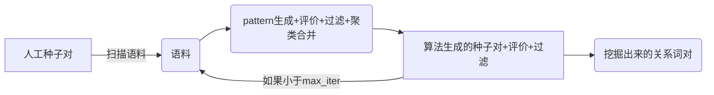

# Snowball4ZH
适用于中文的半监督开放关系提取方法：[Snowball: Extracting Relations from Large Plain-Text Collections](http://www.cs.columbia.edu/~gravano/Papers/2000/dl00.pdf)

Readme可以当作是对这篇文章的简单解读。

## 1. 前言
Snowball是一种启动代价较小的关系抽取方法；利用少量的种子关系对，采用自举式（bootstrap）的方式，迭代挖掘新规则、新种子关系对。类似**滚雪球**，所以取名**雪球**可以说是相当的形象了。


## 2. 大致的原理和流程

术语对齐： 
* 种子对 = tuple/seed
* 规则 = pattern
* cos/sim = 内积/cosine相似度
* before 缩写为 bef
* between 缩写为 bet
* after 缩写为 aft



整个流程包含4个功能模块

* pattern generation [规则生成]
* tuple/new seed generation [新种子对的生成]
* pattern evaluation + filter [规则模板的评价与删除]
* tuple evaluation + filter [新种子对的评价与删除]


### 2.1 运行流程
在seed_positive.txt 中 定义了实体的名称和类型共15对（这是初始化启动的必要知识）
，seed_negative.txt 可以为空
```
e1:DIS
e2:DIS

痤疮;青春痘
梦游;睡行症
脑卒中;中风
```

#### 2.1.1 使用每一个关系pair，对所有的语料进行扫描；
语料示例：
```
<SYM>精神</SYM> 科 专家 指出 ， <DIS>脑卒中</DIS> 就是 俗称 的 <DIS>中风</DIS> ， 是 老年人 <DIS>脑血管常见病</DIS> ， 会 影响 老年人 的 行动 、 语言 沟通 能力 、 思维 等

<DIS>痤疮</DIS> ， 俗称 <DIS>青春痘</DIS> 的 发病 原因
```
通过使用种子词对对语料的扫描

得到如下pattern (5元组) （before, <entity_1>, between, <entity_2>, after）

* ( "专家 指出" ， [DIS], "就是 俗称 的", [DIS], "， 是 老年人" ）
* ( ""， [DIS], "， 俗称" , [DIS], "的 发病 原因" ）

#### 2.1.2 计算每个pattern的分数

举例：

使用pattern1 扫描所有文档， 得到候选{tuple_1, tuple_2, ... ,tuple_n)；

假设1~n个关系对中有10个tuple在原始的seed_positive.txt中，则pattern1的得分为0.66（10/15）； 如果大于人为设定的阈值，则保留该规则；
对应论文中的公式**Definition 3:** 
$$cond(P)=\frac{P_{positive}}{P_{positive}+P_{negative}}$$


#### 2.1.3 计算tuple的分数

公式如下： 大致的理解就是 如果这个tuple由分数高的pattern产生的，且由多个pattern共同生成（反映在阶乘），那么这个tuple的可信度就越高。对应文中的公式**Definition 5:**

$$Conf(T) = 1-\prod_{i=0}^{|P|}(1-Conf(P_{i})*Match(Ci,Pi))$$

#### 2.1.4 合并pattern

pattern 是一个5元组

（before, <entity_1>, between, <entity_2>, after）

( "专家 指出" ， [DIS], "就是 俗称 的", [DIS], "， 是 老年人" ）
( ""， [DIS], "， 俗称" , [DIS], "的 发病 原因" ）


为了计算pattern之间的相似度， 必须将pattern进行向量话， 这里的向量化是针对一个pattern的before，between, after; 三个部分的向量， 这里可以采用tf-idf 对这个三个字符串进行向量化；

$$sim(pattern1, pattern2) = 0.2 * V1_{bef} * V2_{bef} + 0.6 * V1_{bet} * V2_{bet}+ 0.2 * V1_{aft} * V2_{aft}$$

中间的词汇权重为最大（0.6）比较重要，这是符合常识的。

sim(pattern1, pattern2) > 阈值， 那么pattern1和pattern2 会归到同一个pattern组内。


重复上述过程，直至迭代次数消耗完毕。

## 3. 实验参数
迭代轮次5次， 规则置信度0.6; 详见parameters.cfg

本次实验中，正样本种子给了15个；

痤疮;青春痘
梦游;睡行症
脑卒中;中风
脂肪性肝炎;脂肪肝
抑郁症;抑郁障碍
颈椎病;颈椎综合征
膝关节软骨磨损;膝关节退行性变
灰指甲;甲真菌病
皮肤癌;基底细胞癌
心肌病;TCM
心肌病;一过性心脏综合征
灰指甲;皮肤病
房颤;心律失常
小儿脑性瘫痪;小儿大脑性瘫痪
小儿大脑性瘫痪;急性鼻炎
荨麻疹;风疹块
包含同义关系（痤疮;青春痘）、上下位关系（灰指甲;皮肤病）

## 4. 引用
英文版本地址：https://github.com/davidsbatista/Snowball

## 5. 其它
数据输入的格式： 可以参考如下样例数据
```
<SYM>精神</SYM> 科 专家 指出 ， <DIS>脑卒中</DIS> 就是 俗称 的 <DIS>中风</DIS> ， 是 老年人 <DIS>脑血管常见病</DIS> ， 会 影响 老年人 的 行动 、 语言 沟通 能力 、 思维 等
<DIS>痤疮</DIS> ， 俗称 <DIS>青春痘</DIS> 的 发病 原因
```

运行：
```
python Snowball.py parameters.cfg corpus.txt seeds_positive.txt seeds_negative.txt 0.6 0.6
```